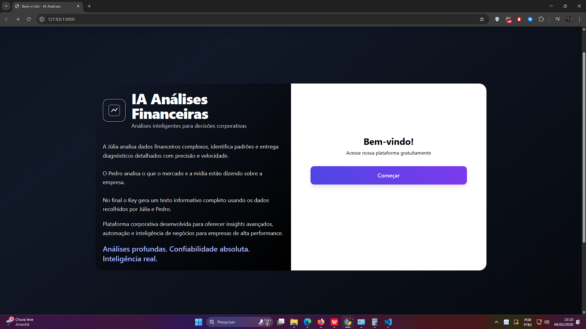
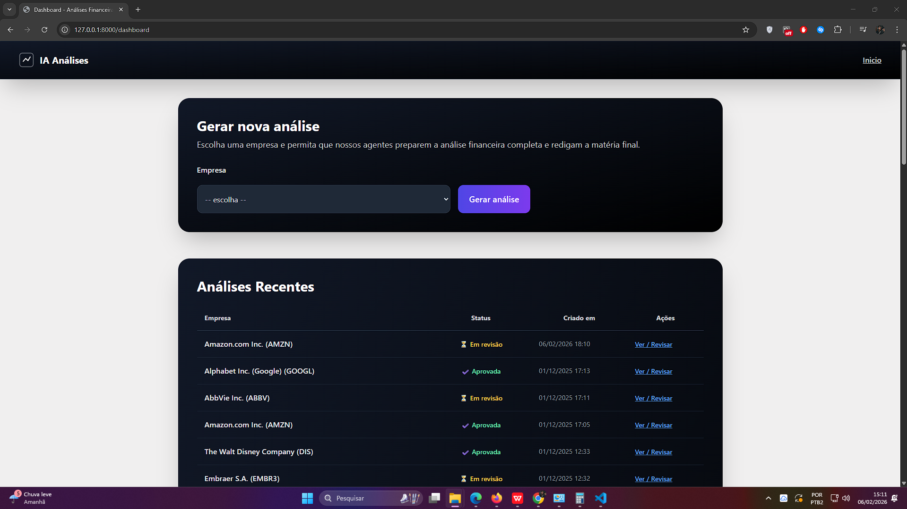
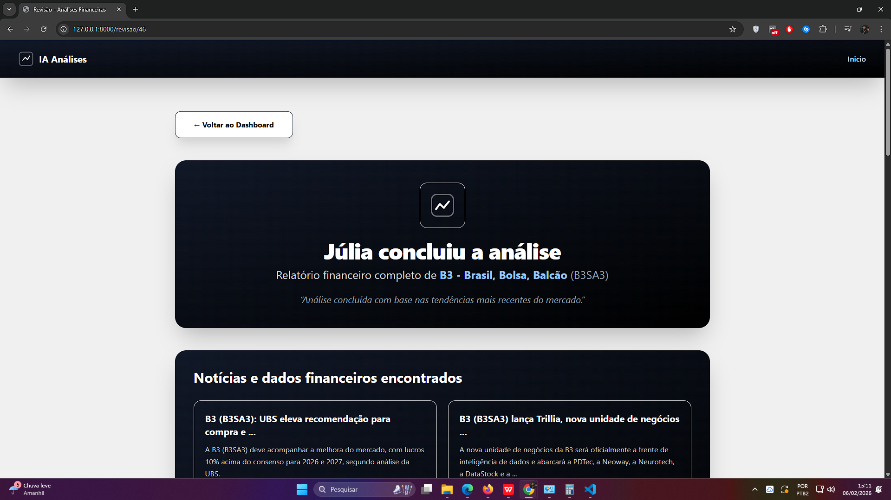

# Sistema de Análise de Dados e Integração com APIs

**Descrição**  
Sistema web desenvolvido com **Laravel** para análise de dados, integração com APIs externas e gerenciamento de informações. O projeto é modular, escalável e utiliza tecnologias modernas para backend e frontend, garantindo **segurança**, **eficiência** e uma experiência fluida para os usuários.

## Tecnologias Utilizadas

### Backend
- **PHP** 8.1
- **Laravel** 10
- **JWT** para autenticação
- **Laravel Sanctum** para gerenciamento de sessões
- **Guzzle** para integração com APIs externas
- **Yahoo Finance API** para análise de dados financeiros

### Frontend
- **Blade Templates** para renderização dinâmica
- CSS e JS personalizados
- **Webpack Mix** para compilação e otimização

### Testes e Desenvolvimento
- **PHPUnit** para testes automatizados
- **Mockery** para simulação de dependências
- **Faker** para geração de dados fictícios

### Outras Ferramentas
- **Docker** para padronização do ambiente
- **Composer** para gerenciamento de dependências

## Funcionalidades Principais

- **Autenticação e Segurança**  
  Tokens JWT e Laravel Sanctum para autenticação segura

- **Integração com APIs Externas**  
  Conexão com Yahoo Finance para análise de dados financeiros  
  Chamadas HTTP com Guzzle

- **Gerenciamento de Dados**  
  Banco de dados gerenciado com **Eloquent ORM**  
  Migrações e seeders para configuração e popular o banco

- **Frontend Dinâmico**  
  Renderização de páginas com Blade Templates  
  Design responsivo e interativo

- **Testes Automatizados**  
  Testes unitários e de integração para garantir qualidade

- **Configuração de CORS**  
  Permite acesso seguro de diferentes origens

- **Automação**  
  Comandos Artisan para tarefas administrativas

## Estrutura do Projeto

- **Backend**: Gerencia autenticação, rotas, lógica de negócios e integração com APIs
- **Frontend**: Interface dinâmica e responsiva, com integração direta ao backend
- **Banco de Dados**: Estruturado com migrações e seeders para consistência
- **Testes**: Localizados na pasta `tests/`, garantindo cobertura de código

## Diferenciais

- Arquitetura **modular** e **escalável**
- Suporte a múltiplos ambientes (desenvolvimento, produção)
- Integração com serviços financeiros para análise de dados
- Uso de **Docker** para consistência no ambiente de desenvolvimento

Este sistema é ideal para **análise de dados financeiros** e **jornalísticos**, com foco em segurança, eficiência e experiência do usuário.

## Capturas de tela do projedo rodando

  
  

  
  
    
      

